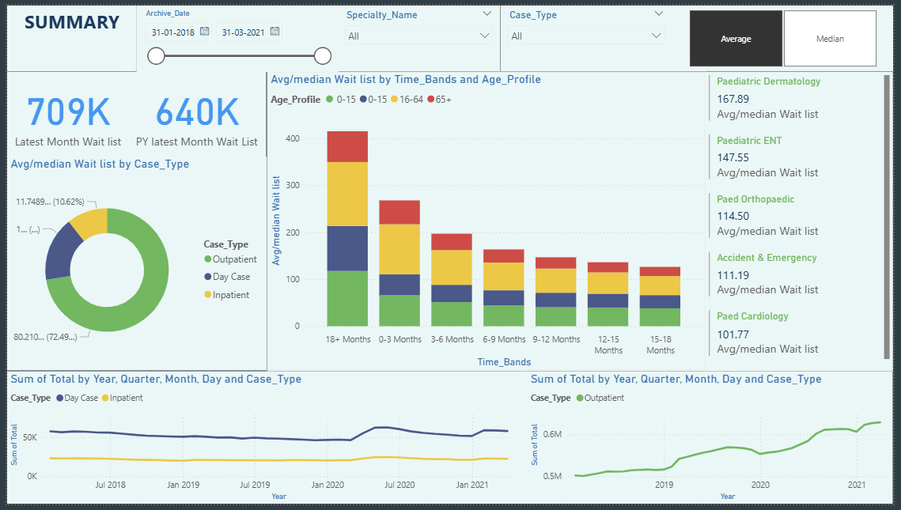

# Patient Waitlist – Power BI Dashboard

## Project Overview  
This project provides an interactive analytical overview of patient waitlists across different case types, age profiles, and medical specialties. The dashboard enables healthcare administrators and analysts to track waitlist trends, monitor patient load, and assess performance across outpatient, day case, and inpatient categories. The insights help in improving resource allocation and reducing patient wait times.

## Objectives  
- Monitor overall patient waitlist size and compare year-over-year trends.  
- Analyze waitlist distribution by case type (Outpatient, Day Case, Inpatient).  
- Study waitlist segmentation by time bands (e.g., 0–3 months, 6–9 months, 18+ months).  
- Explore age profile impact on waitlist volumes (0–15, 16–64, 65+).  
- Identify specialties with the highest average/median waitlist.  
- Track long-term trends in waitlists by year, quarter, and month.  

## Data Preparation  
Data Source: Multiple patient waitlist CSV files containing 20K+ rows each.  

Cleaning & Transformation:  
- Removed duplicates and standardized patient case type categories.  
- Converted time bands into ordered categorical ranges.  
- Created DAX measures for:  
  - Average/median waitlist by case type.  
  - Waitlist totals across time bands and age groups.  
  - Specialty-specific waitlist KPIs.  

## Key Features & Insights  

### KPIs  
- 709K patients in the latest month’s waitlist.  
- 640K patients in the previous year’s same month waitlist.  
- Specialty-level KPIs:  
  - Paediatric Dermatology: 167.89 (Avg/Median waitlist)  
  - Paediatric ENT: 147.55  
  - Accident & Emergency: 111.19  
  - Paediatric Cardiology: 101.77  

### Visualizations  
- Donut Chart – Case Type Split: Proportion of Outpatient, Day Case, and Inpatient waitlists.  
- Bar Chart – Time Bands & Age Profile: Breakdown of waitlists by age group (0–15, 16–64, 65+) across different wait time bands.  
- Trend Lines – Yearly & Quarterly Trends: Long-term trends in waitlist volumes by case type.  
- Specialty KPIs Panel: Highlights top specialties with the highest average/median waitlists.  

## Tools & Technologies  
- Power BI Desktop – Dashboard creation and interactive design.  
- Power Query – Data cleaning and transformation.  
- DAX – Calculated measures for averages, medians, and KPIs.  

## Deliverables  
- Interactive Power BI dashboard (.pbix) built from CSV files containing 20K+ rows each.  
- Patient waitlist summary dashboard with slicers for:  
  - Case Type  
  - Specialty Name  
  - Archive Date Range  
- Exportable insights for healthcare decision-making.  

## Dashboard Preview  
  
